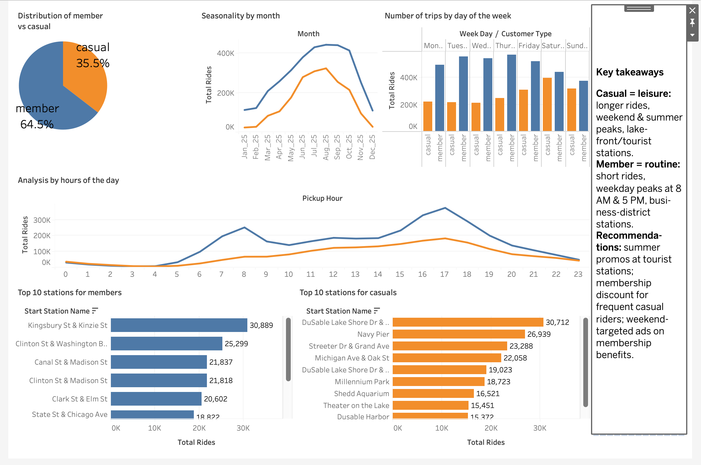

## Cyclistic Bike-Share Analysis
### Google Data Analytics Capstone Project


---

## Project Overview

This project is a capstone case study completed as part of the **Google Data Analytics Professional Certificate** on Coursera. It explores how **casual riders** and **annual members** use Cyclistic bike-share services differently — with the goal of informing a marketing strategy to convert casual riders into annual members.

**Business Question:**
> *How do annual members and casual riders use Cyclistic bikes differently?*

🔗 **Interactive dashboard:** [Cyclistic Bike-Share on Tableau Public](https://public.tableau.com/app/profile/oleksandr.synichenko/viz/DashboardCyclisticBikeShare/Dashboard1)

This repository documents the analysis through **two complete, independent implementations** — first in **R / RStudio**, then in **Google BigQuery (SQL) + Tableau**. The journey between the two is itself a core finding of the project (see *Methodology* below).

---

## Company Background

**Cyclistic** is a fictional bike-share company based in Chicago operating a fleet of **5,800+ bicycles** across **600+ docking stations**, with three pricing tiers: single-ride passes, full-day passes, and annual memberships. The finance team has determined that **annual members are significantly more profitable** than casual riders. The Director of Marketing, Lily Moreno, wants to maximize annual memberships by converting existing casual riders rather than acquiring new customers from scratch.

---

## Methodology — A Two-Phase Approach (and the lesson in between)

This project was built twice, on purpose. The second build was not a rewrite for its own sake — it grew out of a data-integrity problem that changed how I think about cleaning data.

### Phase 1 — R / RStudio (the textbook approach)

I started the classic certificate way: combine the 12 monthly files, then clean, clean, and clean again — remove duplicates, drop rows with missing values, drop invalid dates, filter duration outliers. This produced a clean dataset of **~5.4M rows** and a set of static `ggplot2` charts.

### Phase 2 — Google BigQuery + Tableau (the rebuild)

For practice with SQL at scale, I re-implemented the same pipeline in BigQuery. My first SQL version followed the same "remove anything incomplete" instinct and added a filter to drop every ride with a missing **station name**.

That single filter quietly removed **~1.2 million valid rides** — about a third of the data.

That was the turning point. A ride with a blank *station* is still perfectly valid for almost every question we actually ask: ride duration, time of day, day of week, month, bike type, member vs. casual. Deleting those rides just to satisfy a "no missing values" checklist would have distorted **every** chart — and, more importantly, the business decisions built on them. Losing a million rows is not a cosmetic issue; it can change what the client decides to do.

**The corrected principle:** *look at the whole picture first, then decide what to remove — and remove data only where it's actually required.*

So the cleaning was restructured around a **two-base methodology**:

- **Full base** — all valid rides (missing station names kept). Used for distribution, duration, day-of-week, hour, seasonality, and bike-type analyses.
- **Station base** — only rides with a recorded start station. Used **exclusively** for the Top-10 station analyses.

The corrected BigQuery dataset converged back to **~5.4M rows** — essentially the same row count as the R phase. (Interestingly, the R pipeline had sidestepped the trap by accident: in the source data, missing stations are empty strings `""` rather than `NA`, so R's `drop_na()` never removed them. BigQuery reads those same blanks as `NULL`, which is why the trap only surfaced in SQL.)

The cleaned BigQuery output was exported as nine CSVs, which became the single source of truth for the **Tableau dashboard**. The full corrected SQL lives in [`scripts/cyclistic_analysis_fixed.sql`](scripts/cyclistic_analysis_fixed.sql).

> **Why some figures differ between phases:** the two phases use slightly different cleaning rules (e.g. boundary handling for the 1-minute / 24-hour duration cut, and the corrected handling of a month that had been double-loaded during the initial BigQuery import). The **patterns** are identical across both phases; the **headline numbers below come from the final, corrected BigQuery → Tableau dataset**, which is the authoritative version that feeds the live dashboard.

---

## Tools & Technologies

| Phase | Tool | Purpose |
|-------|------|---------|
| 1 | **RStudio Desktop (macOS)** | Import, cleaning, transformation, analysis, static charts |
| 1 | **R packages** | `tidyverse`, `lubridate`, `dplyr`, `ggplot2`, `janitor`, `psych`, `readr` |
| 2 | **Google BigQuery (SQL)** | Scalable cleaning & aggregation; produced the final analysis CSVs |
| 2 | **Tableau Public** | Interactive dashboard & data storytelling |
| — | **GitHub** | Version control and portfolio hosting |

> Excel and Google Sheets were not viable due to the 1.12 GB dataset size.

---

## Dataset

| Parameter | Details |
|-----------|---------|
| **Source** | [Divvy Trip Data](https://divvy-tripdata.s3.amazonaws.com/index.html) by Motivate International Inc. |
| **License** | [Divvy Data License Agreement](https://divvybikes.com/data-license-agreement) |
| **Period** | January 2025 – December 2025 (12 months) |
| **Raw size** | 1.12 GB / 5,552,994 rows |
| **After cleaning** | ~5.4M valid rides (both phases converge here) |
| **Columns** | 13 original |

> **Privacy Note:** All personally identifiable information has been removed from the dataset. It is not possible to connect rides to individual users or credit card data.

---

## Data Processing Pipelines

### Phase 1 — R pipeline

```
Raw CSV files (12 months)
        ↓
   [1] Import & validate column names
        ↓
   [2] Combine into one dataframe (rbind)
        ↓
   [3] Remove out-of-range dates
        ↓
   [4] Remove duplicates (distinct)
        ↓
   [5] Remove NA values (drop_na)
        ↓
   [6] Remove invalid rides (started_at > ended_at)
        ↓
   [7] Rename columns; feature engineering (date, month, week_day, hour, tour_length)
        ↓
   [8] Filter duration outliers (< 1 min / > 1440 min)
        ↓
   [9] Save clean CSV → ggplot2 charts
```

### Phase 2 — BigQuery pipeline (final)

```
12 monthly tables
        ↓
   [1] UNION ALL with an explicit column list (avoids positional column mismatch)
        ↓
   [2] Data-quality diagnostics (NULLs, duplicates, invalid dates, outliers) — count only
        ↓
   [3] Build trips_cleaned:
         • keep all valid rides (NO global station filter)
         • drop only genuinely bad rows (broken IDs/timestamps, impossible dates,
           sub-1-min / over-24-h outliers)
        ↓
   [4] Analyses 01-06, 09 → FULL base
       Analyses 07-08 (Top-10 stations) → station filter applied LOCALLY
        ↓
   [5] Export 9 CSVs → Tableau dashboard
```

---

## Analysis & Key Findings
*(Headline figures from the final BigQuery → Tableau dataset.)*

### 1. Customer Split
| Customer Type | Share |
|--------------|-------|
| Member | **64.5%** |
| Casual | **35.5%** |

Members make up roughly two-thirds of rides — but the casual third is the conversion opportunity.

### 2. Ride Duration — Casual vs Member
| Metric | Casual | Member |
|--------|--------|--------|
| Mean duration | **~19.9 min** | ~12.2 min |
| Median duration | ~11.8 min | ~8.8 min |

Casual rides are markedly longer on both mean and median — and the gap is wider on the mean, indicating long "leisure" tails. Consistent with sightseeing rather than commuting.

### 3. Usage by Day of Week
Members are steady and high **Monday–Friday** (commuting); casual riders **surge on Saturday and Sunday** (leisure/tourism).

### 4. Seasonal Trends
Both groups peak in summer (**June–August**), but casual demand is far more seasonal — a steep summer curve versus the members' flatter, year-round commuting pattern.

### 5. Bike Type Preference
| Customer | Classic | Electric |
|----------|---------|----------|
| Casual | ~34.9% | **~65.1%** |
| Member | ~36.6% | **~63.4%** |

Both groups prefer electric bikes; casual riders lean slightly more electric.

### 6. Top Start Stations — Casual vs Member
| Top casual stations | Top member stations |
|---------------------|---------------------|
| DuSable Lake Shore Dr & Monroe St | Kingsbury St & Kinzie St |
| Navy Pier | Clinton St & Washington Blvd |
| Streeter Dr & Grand Ave | Canal St & Madison St |
| Michigan Ave & Oak St | Clinton St & Madison St |
| DuSable Lake Shore Dr & North Blvd | Clark St & Elm St |

Casual stations are **lakefront and tourist destinations**; member stations are **business-district / commuter hubs**. This is the strongest single signal that many casual riders are visitors, and it tells marketing exactly *where* to act.

### 7. Rides by Hour of Day
Members show two sharp peaks — **8:00 AM** and **5:00 PM** (classic commute). Casual riders show one broad afternoon peak — a leisure pattern.

---

## Visualizations

### Phase 1 — Static charts (R / ggplot2)


### Phase 2 — Interactive dashboard (BigQuery + Tableau)

🔗 **Live dashboard:** [Cyclistic Bike-Share — Tableau Public](https://public.tableau.com/app/profile/oleksandr.synichenko/vizzes)



The dashboard combines six linked views — distribution, seasonality, day of week, hour of day, and Top-10 stations for each rider type — plus a text panel with the key takeaways. A consistent color scheme is used throughout: **casual = orange, member = blue**.

> **Data-integrity note:** the Top-10 station views use only rides with a recorded start station (the *station base*); all other views use the *full base*. This is the two-base methodology described above, so a station view will legitimately show fewer total rides than a full-base view.

---

## Recommendations

###  Recommendation 1 — Seasonal Conversion Campaign (May–June)
Launch conversion campaigns in **May**, just as casual ridership begins ramping up, rather than at the summer peak when riders are already committed to pay-per-ride. Target the top casual start stations with digital and physical advertising, and offer a **first-month discount** as an incentive.

###  Recommendation 2 — Electric Bike as the Membership Hook
Casual riders favor electric bikes, which are more expensive per ride. Campaign angle: *"Unlimited electric rides for the price of a membership."* A direct, quantifiable financial argument built on the rider's existing behavior.

###  Recommendation 3 — Weekend Membership Tier
Casual riders are concentrated on weekends, so a full annual membership may not make sense for someone who never rides on weekdays. A lower-cost **"Weekend Pass"** tier lowers the conversion barrier, builds the riding habit, and acts as a pipeline to full annual membership.

---

## Repository Structure

```
cyclistic-bike-share-analysis/
│
├── README.md                              # This file
│
├── data/
│   ├── raw/                               # Original monthly CSVs (not uploaded — 1.12 GB)
│   └── processed/                         # Cleaned data (not uploaded — large)
│
├── scripts/
│   ├── Cyclistic_Bike_Analysis.R          # Phase 1 — full R script (cleaning + ggplot2)
│   └── cyclistic_analysis_fixed.sql       # Phase 2 — final BigQuery SQL (two-base methodology)
│
├── analysis/
│   └── Cyclistic_BS_Analysis_in_R.docx    # Full analysis documentation
│
└── visualizations/
    └── All charts produced in (R)        # Phase 1 — static R / ggplot2 charts
    └── tableau_dashboard/
        └── Dashboard.png                  # Phase 2 — Tableau dashboard screenshot
                                           # Live: https://public.tableau.com/app/profile/oleksandr.synichenko/vizzes
```

---

## How to Reproduce

**Phase 1 (R):**
1. Download 12 months of trip data from [Divvy Trip Data](https://divvy-tripdata.s3.amazonaws.com/index.html).
2. Set your working directory in `scripts/Cyclistic_Bike_Analysis.R`.
3. Run the script — it combines, cleans, analyzes, and generates the ggplot2 charts.

**Phase 2 (BigQuery + Tableau):**
1. Load the 12 monthly CSVs into a BigQuery dataset (`new_cyclistic_data`).
2. Run `scripts/cyclistic_analysis_fixed.sql` — it builds the cleaned table and the nine analysis queries.
3. Export each query result as CSV and connect them in Tableau Public to rebuild the dashboard.

**Required R packages:**
```r
install.packages(c("tidyverse", "lubridate", "dplyr", "janitor",
                   "tidyr", "data.table", "readr", "psych",
                   "hrbrthemes", "ggplot2"))
```

---

## Author

**Oleksandr Synichenko**
IT Professional | Data Analytics Enthusiast

https://www.linkedin.com/in/itspecotonopts/

Google Data Analytics Professional Certificate — Coursera, 2025

---

## License

The Cyclistic dataset is made available by **Motivate International Inc.** under the [Divvy Data License Agreement](https://divvybikes.com/data-license-agreement). This project is for educational purposes only.
